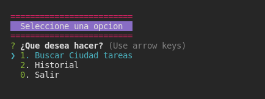
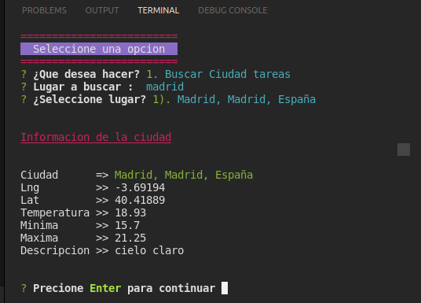
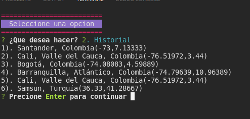

## App Climate


Configuracion inical para consumos de api de ubicacion

Instalcion de dependecias

```shell
npm i colors inquirer axios
```

Vinculacion de mapbox al proyecto `https://account.mapbox.com/`
Vinculacion de openweathermap al proyecto `https://api.openweathermap.org`


Paquete para leer los arhivos .env y configurarle  las variables de entorno 

```shell
npm i dotenv
```

> Se consulta el api de mapbox para traer la longitud y latitud de alguna ubicacion para posteriormente consultar el clima de ese lugar


## Detalles de la aplicacion





